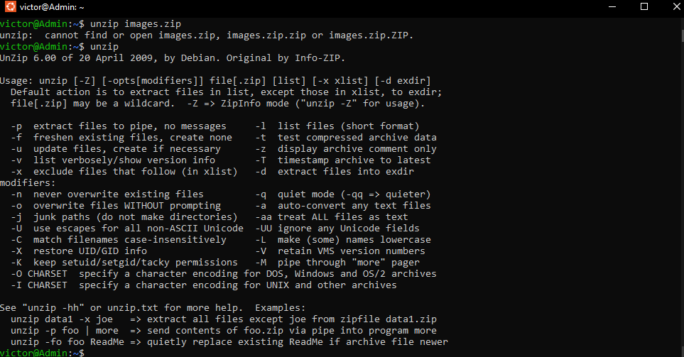

10 Linux commands

- wget:
    (World Wide Web get) is a utility to retrieve content from the internet.
    

- uname:
    (short for “Unix name”) prints the operative system information, which comes in handy when you know your current Linux version.
    

- whatis:
    prints a single-line description of any other command, making it a helpful reference
    

- history:
    If you’re struggling to remember a command, history comes in handy. This command displays an enumerated list with the commands you’ve used in the past
    

- unzip:
    The unzip command allows you to extract the content of a .zip file from the terminal. Once again, this package may not be installed by default, so make sure you install it with your package manager.
    

- exit:
    The exit command does exactly what its name suggests: With it, you can end a shell session and, in most cases, automatically close the terminal you’re using.

- chmod:
    The chmod command lets you change the mode of a file (permissions) quickly.

 -touch:
    the touch command can be used to creach new files.
    

- man:
    it displays the manual page of any other command (as long as it has one). For this example, we would run the command `man touch`
    

- alias:
    The alias command lets you define temporary aliases in your shell session. When creating an alias, you instruct your shell to replace a word with a series of commands.